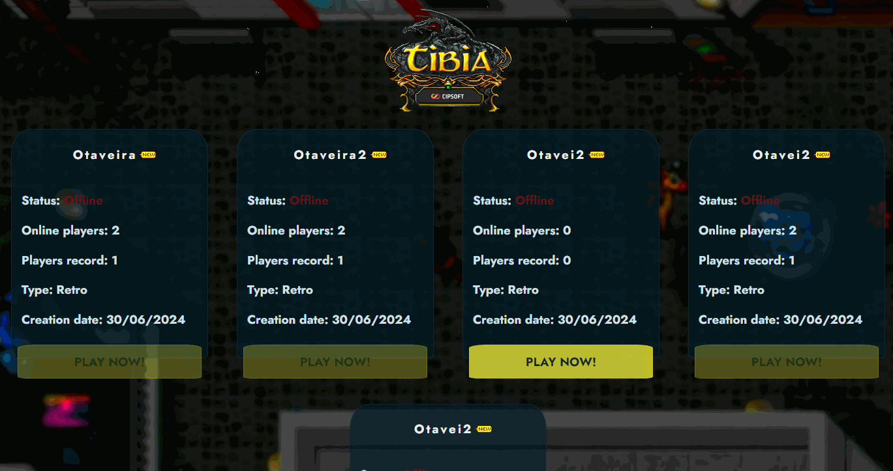

# Open Tibia Landing Page
Um projeto que acabei pegando como trabalho, que, no final, acabei gostando do resultado e utilizando no meu portfólio.

Para o uso da landing page, é necessário implementar uma nova rota em sua aplicação, sendo `url/api/infos.php` (a julgar que você esteja usando algum AAC escrito em php), você pode encontrar um exemplo de como fazer isto no gesiorAAC [aqui](https://github.com/httpsotavio/gesior). É necessário a implementação desta rota para a atualização de jogadores atualmente online, record de jogadores online e o atual status do servidor.

## Técnologias

Foi utilizado apenas React.

### Scripts
[Os scripts serão os padrões encontrados na documentação do react.](https://create-react-app.dev/docs/available-scripts)

### Testes
O projeto não contem testes, visto que é algo extremamente simples e single-page.

## Para leigos
Todo este projeto, no final, se tornará alguns arquivos que você hospedará, você deverá instalar o [node](https://nodejs.org/en/download/package-manager/current), logo após baixar o repositório direto do github.

Após, abra o terminel e vá até a pasta da aplicação e rode o comando `npm i`, com isto, o node deverá ser o responsável por baixar todos os pacotes necessários para rodar a aplicação. Com tudo feito, vá em `/src/LPConfig.json` e insira as informações de seus servidores, logo após, `/public/index.html`, procure pela tag title e altere para o que desejar que seja o titulo exibido na página web, altere o arquivo favicon.ico para o icone que deseja. Existem algumas outras alterações que você pode fazer, dá uma explorada! Utilize `npm run build`, notará uma nova pasta em seu projeto, é toda a sua landing page compilada. Bom uso!

# Preview
